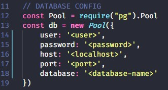

<h1 align="center">Doe</h1>
 
 
<h3 align="center">Projeto feito com Javascript, Html e Css, com intuito de ajudar iniciantes a entrar na carreira da programação</h3>
  
<h2>Objetivo:</h2>
<h4>Ajudar iniciantes a entender a carreira de programação</h4>
<h2>Tecnologias:</h2>
<h4>> Express</h4>
<h4>> Nunjucks</h4>
<h4>> Nodemon</h4>
<h4>> Postgres</h4>
<h2>Como utilizar:</h2>
<ul>
  <li>Instalar o node caso não tenha</li>
  <li>Instalar o postgres caso não tenha</li>
  <li>Criar um banco de dados, e uma tabela com o nome "donors", com três colunas uma para name, email e blood</li>
  <li>Preencher com as suas configurações do DB</li>
  
  <li>Depois disso tudo rodar npm start e seu projeto estará funcionando!</li>
</ul>

<h5 align="center">Desenvolido na MaratonaDev, evento realizado pela <a href="https://github.com/Rocketseat">rocketseat</a></h5>
